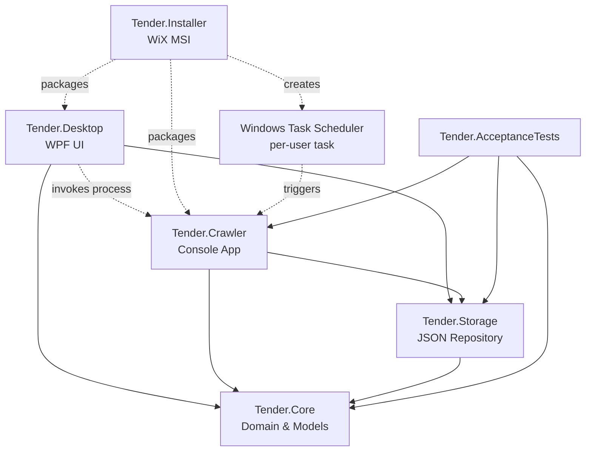

# 架構設計（Architecture）

> 文件目的：定義「標案搜尋工具」桌面應用程式的整體架構、模組分層、資料流、相依關係與風險緩解。本文件為 SA 階段產物，作為 csharp-expert 實作的依據。
> 對應需求：`pm/tender_software_requirements.md` 第 7 節技術架構、第 9 節 JSON 結構、第 10 節 MVP。
> 產出日期：2026-05-08

---

## 1. 技術選型總覽（已由使用者決議）

| 類別 | 選型 | 版本/說明 |
|---|---|---|
| 語言 | C# | .NET 8 (LTS) |
| 桌面 UI | WPF + MVVM | 不使用 WinUI 3 |
| 程式架構 | MVVM | `CommunityToolkit.Mvvm` 提供 `ObservableObject` / `RelayCommand` |
| JSON 序列化 | `System.Text.Json` | .NET 內建 |
| 爬蟲 HTTP | `HttpClient` + `AngleSharp` | AngleSharp 1.x 解析 HTML |
| 爬蟲備案 | `Microsoft.Playwright` | 僅在 PoC 確認 HttpClient 不足時切換 |
| Excel 匯出 | `ClosedXML` | 0.102+ |
| 排程 | Windows Task Scheduler | Per-user 任務 |
| 安裝包 | WiX Toolset | MSI |
| BDD 測試 | Reqnroll | SpecFlow 後繼者，2.x |
| 單元測試 | xUnit + FluentAssertions + Moq | 由 csharp-expert 階段確認 |

---

## 2. 專案結構與相依關係

### 2.1 Solution Layout

```
Tender.sln
├── src/
│   ├── Tender.Desktop/        ← WPF UI (Application Layer)
│   ├── Tender.Crawler/        ← Console App (Crawler Worker)
│   ├── Tender.Core/           ← Class Library (Domain & Use Cases)
│   ├── Tender.Storage/        ← Class Library (Persistence Adapter)
│   └── Tender.Installer/      ← WiX MSI 專案
└── tests/
    ├── Tender.Core.Tests/
    ├── Tender.Storage.Tests/
    ├── Tender.Crawler.Tests/
    └── Tender.AcceptanceTests/  ← Reqnroll BDD 接收測試
```

### 2.2 相依關係（Dependency Graph）



### 2.3 分層原則

| Layer | 專案 | 不可相依的對象 |
|---|---|---|
| Domain（最內層） | `Tender.Core` | 不可相依任何其他內部專案 |
| Adapter（基礎設施） | `Tender.Storage` | 只能相依 `Tender.Core` |
| Application（應用） | `Tender.Crawler`、`Tender.Desktop` | 可相依 `Tender.Core` 與 `Tender.Storage`，但兩個 application 之間不可互相相依（透過 process 呼叫） |
| Packaging | `Tender.Installer` | 不含程式邏輯，僅打包 |

---

## 3. 資料流（Data Flow）

### 3.1 排程觸發路徑（Scheduled Crawl）

```
[每日 17:00] 
    ↓
Windows Task Scheduler (per-user task)
    ↓
Tender.Crawler.exe --mode scheduled --target-date <today>
    ↓
ICrawler.FetchAsync(targetDate, tenderMethods[])
    ↓ HttpClient + AngleSharp
政府電子採購網 (https://web.pcc.gov.tw/...)
    ↓ 回傳 HTML
ITenderParser.Parse(html) → IEnumerable<TenderItem>
    ↓
IKeywordMatcher.AnnotateMatchedKeywords(items)
    ↓
ITenderRepository.MergeDailySnapshotAsync(date, items)
    ├── 讀取既有 tenders.json（若存在）
    ├── 以 sourcePk 去重，分類為 inserted / updated / skipped
    ├── 寫入 tenders.tmp.json，原子替換為 tenders.json
    ↓
IDailySummaryService.GenerateAsync(date) → 寫入 summary.json
    ↓
ICrawlRunLogger.AppendRunAsync(runResult) → 寫入 crawl-runs.json
    ↓
任何錯誤 → IErrorLogWriter.AppendAsync(date, error) → 寫入 errors.log
```

### 3.2 桌面 UI 開啟路徑（Desktop Launch）

```
[使用者雙擊桌面捷徑]
    ↓
Tender.Desktop.exe (App.xaml.cs OnStartup)
    ↓
1. IMissedRunDetector.CheckAsync()
    ├── 若今天 17:00 已過且 summary.json 不存在或 lastRunStatus != success
    ├── → 啟動 Tender.Crawler.exe --mode catchup --target-date <today> 補跑
    ↓
2. ShellViewModel.LoadAsync()
    ↓
IMonthlyCalendarService.LoadMonthAsync(year, month)
    ├── 列出 data/yyyy-MM/yyyy-MM-dd/ 目錄
    ├── 只讀取每個 summary.json（不解析 tenders.json）
    ├── 組合 MonthlyCalendarView
    ↓
WPF 行事曆顯示每日筆數
```

### 3.3 日期查詢頁路徑（Daily Query）

```
[使用者點擊行事曆某日]
    ↓
DailyQueryViewModel.LoadAsync(date)
    ↓
ITenderRepository.LoadDailySnapshotAsync(date)
    ↓ 讀取 tenders.json
DailyQueryView { Items, Filters, SortKey }
    ↓
[使用者輸入搜尋/套用篩選]
    ↓
ISearchService.Search(items, criteria)
    ↓
WPF DataGrid 顯示結果
    ↓
[使用者點擊「匯出」]
    ↓
SaveFileDialog → IExcelExporter.ExportAsync(filteredItems, savePath)
    ↓ ClosedXML
.xlsx 產出
```

### 3.4 手動立即更新路徑（Manual Update）

```
[使用者點擊「立即更新」]
    ↓
ShellViewModel.RunCrawlerNowCommand
    ↓
ICrawlerLauncher.LaunchAsync(mode = manual, date = today)
    ↓ 啟動 Tender.Crawler.exe 子程序（非阻塞）
等待程序結束 + 監控 stdout 取得進度
    ↓
完成後 IMonthlyCalendarService.RefreshDayAsync(today)
    ↓ 重新讀取 today 的 summary.json，更新行事曆筆數
```

---

## 4. 補跑機制設計（雙重保險）

需求：當 17:00 排程因關機/離線未執行，下一次開機後需補跑一次（已決議：**桌面程式啟動偵測 + Task Scheduler missed run 雙重保險**）。

### 4.1 機制 A：Task Scheduler 內建 missed run

- 建立排程任務時設定旗標：
  - `StartWhenAvailable = true`（任務 XML 中的 `<StartWhenAvailable>` 元素）
  - 該旗標讓 Task Scheduler 在電腦下次可用時自動補跑「過去未執行」的任務
- 由 `Tender.Installer` 在安裝時透過 WiX 執行 `schtasks.exe` 或產生 Task XML 建立。

### 4.2 機制 B：桌面程式啟動偵測

- 桌面程式在 `App.OnStartup` 呼叫 `IMissedRunDetector.CheckAsync()`，邏輯：
  1. 取得今日日期 `today`。
  2. 檢查 `data/yyyy-MM/today/summary.json` 是否存在。
  3. 若不存在，**且**當前時間已 ≥ 17:00：判定為 missed → 觸發補跑。
  4. 若存在，但 `lastRunStatus = failed`：不自動補跑（避免無限重試），由使用者手動處理。
- 防重複觸發：透過檔案鎖（mutex 或 `tenders.lock`）避免桌面程式啟動偵測與 Task Scheduler 同時補跑。

### 4.3 補跑與排程預設行為的區分

- 補跑時 `crawl-runs.json` 該筆 run 紀錄需標示來源：
  - `triggerSource`: `"scheduled"` | `"catchup"` | `"manual"` | `"manual-redo"`
- 對應 PM Gherkin `daily_crawl.feature` 的「補跑完成後 crawl-runs.json 中該筆 run 紀錄應可被識別為補跑」。

---

## 5. 模組契約（對外 API 概觀）

詳細介面簽章見 `interfaces.md`。

### 5.1 `Tender.Core` 對外 API

- `ISearchService`：對 `IReadOnlyList<TenderItem>` 套用搜尋條件，回傳過濾後集合。
- `IKeywordMatcher`：對標案名稱/機關名稱套用關鍵字分類匹配，回傳命中關鍵字清單。
- `ITaiwanDateConverter`：民國年（`115/05/08`）↔ 西元年（`2026-05-08`） 互轉。
- `TenderItem`、`DailySummary`、`CrawlRun`、`KeywordSet` 等領域模型。

### 5.2 `Tender.Storage` 對外 API

- `ITenderRepository`：每日 `tenders.json` 讀寫、合併、原子替換。
- `IDailySummaryRepository`：`summary.json` 讀寫。
- `ICrawlRunLogRepository`：`crawl-runs.json` 讀寫（append-only）。
- `IErrorLogWriter`：`errors.log` 寫入（JSON Lines 格式）。
- `IKeywordsRepository`：`settings/keywords.json` 讀寫。
- `IUserMarksRepository`：`settings/user-marks.json` 讀寫。
- `IAppSettingsRepository`：`settings/app-settings.json` 讀寫。
- `IDataPaths`：集中管理檔案路徑規則（`%LocalAppData%/TenderSearch/data/yyyy-MM/yyyy-MM-dd/...`）。

### 5.3 `Tender.Crawler` 對外契約

- 命令列介面：
  - `--mode <scheduled|catchup|manual|manual-redo>`
  - `--target-date <yyyy-MM-dd>`
- Exit code：`0` = success，`非 0` = failed（具體碼定義於 `interfaces.md`）。
- `stdout`：以 JSON Lines 輸出進度事件，供桌面程式解析顯示。

### 5.4 `Tender.Desktop` 對外契約

- 純 GUI，不對外提供 API。
- 透過 `Process.Start` 啟動 `Tender.Crawler.exe`。

---

## 6. 設定檔與資料目錄

### 6.1 資料根目錄

`%LocalAppData%/TenderSearch/data/`（per-user，配合 per-user 排程任務）

### 6.2 結構

```
%LocalAppData%/TenderSearch/data/
├── 2026-05/
│   └── 2026-05-08/
│       ├── tenders.json
│       ├── summary.json
│       ├── crawl-runs.json
│       └── errors.log
├── settings/
│   ├── keywords.json
│   ├── user-marks.json
│   └── app-settings.json
└── locks/
    └── crawler.lock          ← 防重複執行的檔案鎖
```

### 6.3 原子寫入策略

對於 `tenders.json`、`summary.json`、`crawl-runs.json`：

1. 先寫入 `<filename>.tmp`
2. `File.Move(tmpPath, finalPath, overwrite: true)`（.NET 6+ 在 NTFS 上為原子操作）
3. 失敗時保留 `.tmp`，下次啟動清理或忽略

`errors.log` 因為是 append-only JSON Lines，使用 `FileShare.Read` 開啟即可。

---

## 7. 並發與檔案鎖

| 情境 | 處理方式 |
|---|---|
| 桌面程式 + Crawler 同時讀 `summary.json` | 讀取以 `FileShare.Read` 開啟，不衝突 |
| Crawler 補跑（A） + 手動立即更新（B） 同時觸發 | 透過 `data/locks/crawler.lock`（具名 mutex 或 lock 檔）；後觸發者直接退出並寫入 `crawl-runs.json` 一筆 `status: skipped, reason: "another run in progress"` |
| 桌面程式讀 `tenders.json` 時 Crawler 正寫入 | Crawler 寫 `.tmp` 後再 `File.Move`，桌面程式讀到的永遠是完整版本 |

---

## 8. 日誌與錯誤處理

- 結構化錯誤日誌：`errors.log` 採用 JSON Lines（每行一筆 JSON）：
  ```json
  {"timestamp":"2026-05-08T17:01:23+08:00","severity":"error","source":"crawler","runId":"20260508-170000","message":"Network timeout","exception":"...","page":3}
  ```
- 例外分類：
  - `NetworkException` → 整批失敗，可重試 3 次後寫入 failed run
  - `ParseException` → 單頁失敗，記錄後繼續其他頁，整體 status 為 success（含 errorMessage 提示部分失敗）
  - `IOException` → 寫入失敗，整批 failed
  - `OperationCanceledException` → 使用者取消，不算失敗

---

## 9. 風險與緩解（對應需求文件第 11 節）

| 風險 | 影響 | 緩解策略 |
|---|---|---|
| **R1：政府網站使用 JavaScript 動態渲染** | `HttpClient + AngleSharp` 取不到資料，第一個 sprint 全失敗 | **Phase 2 起手即做爬蟲 PoC**：先用 HttpClient 抓首頁與查詢結果頁，確認是否能取得標案列表；若無法，立即切換 `Microsoft.Playwright`（headless Chromium）。本架構刻意把 `ICrawler` 抽成介面，實作可替換，不影響其他模組 |
| **R2：政府網站反爬蟲（驗證碼、IP 限速）** | 排程被擋 | 加入合理延遲（每分頁 1~2 秒）、User-Agent 模擬正常瀏覽器、失敗指數退避重試（最多 3 次）、單日請求總量上限。若觸發驗證碼，記錄錯誤並通知使用者 |
| **R3：「公開取得電子報價單」option/value 不確定** | 查詢條件帶錯參數，抓不到該類標案 | Phase 2 PoC 階段透過實際查詢頁面把所有招標方式 option/value 對照表列出，存於 `Tender.Core` 的 `TenderMethodMapping` 常數類別 |
| **R4：政府網站欄位異動** | 解析錯誤累積 | `ITenderParser` 對缺欄位採 nullable + 寫入 `errors.log`，不丟整批；定期人工檢查 `errors.log` 趨勢 |
| **R5：JSON 寫入過程中斷導致檔案毀損** | 既有資料丟失 | 採暫存檔 + 原子替換（第 6.3 節），單元測試覆蓋「寫入中斷」情境 |
| **R6：Per-user Task Scheduler 無系統管理員權限時失敗** | 部分企業環境 GPO 鎖定 Task Scheduler | 安裝程式偵測權限失敗時，降級為「每次桌面程式啟動時補跑」，並在安裝結果摘要明確提示 |
| **R7：補跑機制與排程同時觸發造成重複執行** | 同日 crawl-runs.json 出現非預期紀錄 | 透過 `crawler.lock` 檔案鎖；後觸發者退出並記錄 `skipped` |
| **R8：`%LocalAppData%` 路徑無寫入權限** | 安裝失敗或執行時失敗 | 安裝程式預先測試寫入；執行時若失敗，桌面程式顯示明確錯誤訊息並提供切換資料目錄的入口（v2 功能） |

### 9.1 R1 切換 Playwright 的具體流程

1. 在 `Tender.Crawler` 內保留 `ICrawler` 介面與兩個實作：`HttpClientCrawler`、`PlaywrightCrawler`。
2. PoC 階段先實作 `HttpClientCrawler`，跑一次 `--mode poc` 並驗證輸出。
3. 若 PoC 失敗（無法取得標案資料、頁面為空殼 HTML 等），透過 `app-settings.json` 的 `crawlerEngine: "playwright"` 切換實作。
4. Playwright 切換成本：新增 NuGet `Microsoft.Playwright`、首次執行 `playwright install`（安裝 chromium 約 130MB），不影響其他模組程式碼。

---

## 10. 與 PM Bounded Context 對應

| PM Bounded Context | 主要對應專案/模組 |
|---|---|
| 1. 每日爬蟲 | `Tender.Crawler` + `Tender.Storage`（寫入） + `Tender.Core`（KeywordMatcher） |
| 2. 月份行事曆首頁 | `Tender.Desktop`（CalendarView） + `Tender.Storage`（讀 summary.json） |
| 3. 指定日期資料查詢 | `Tender.Desktop`（DailyQueryView） + `Tender.Storage`（讀 tenders.json） + `Tender.Core`（SearchService） |
| 4. 關鍵字快速篩選 | `Tender.Core`（KeywordMatcher、KeywordSet） + `Tender.Desktop`（按鈕綁定） |
| 5. 匯出 Excel | `Tender.Desktop`（觸發） + `Tender.Core`（IExcelExporter 抽象） + ClosedXML 實作 |
| 6. 安裝與排程 | `Tender.Installer` + WiX + Task Scheduler API |
| 7. 更新紀錄與錯誤日誌 | `Tender.Storage`（寫 crawl-runs.json、errors.log） + `Tender.Desktop`（呈現） |
